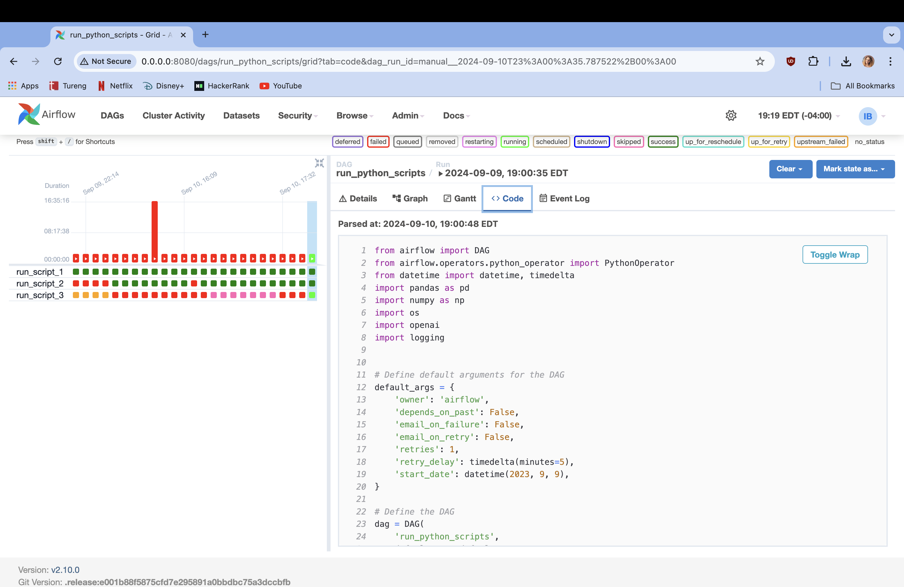
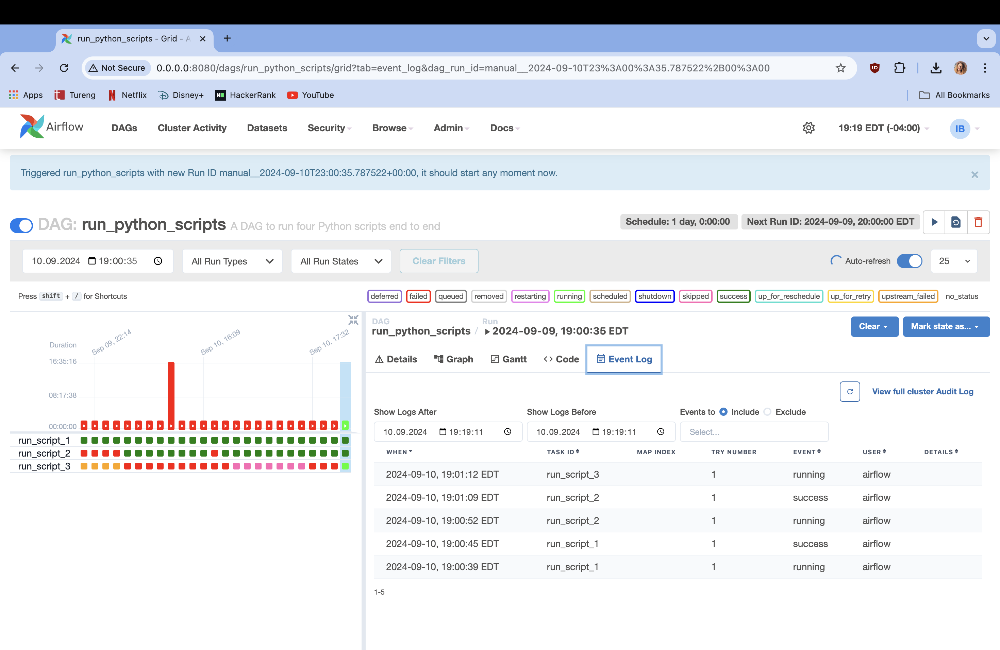
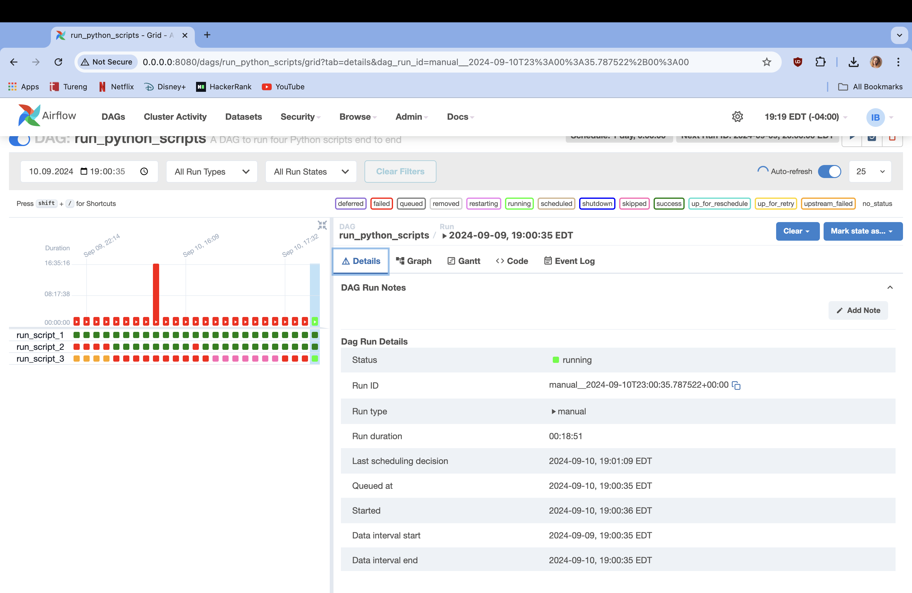
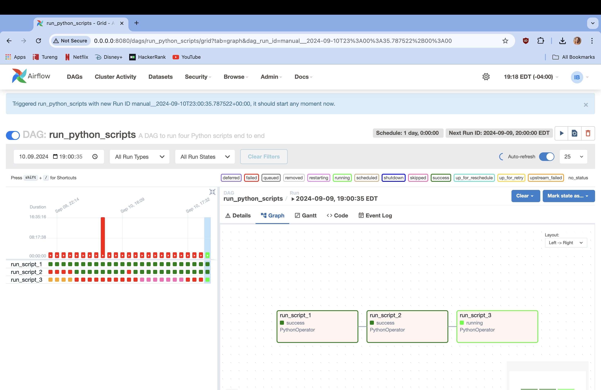
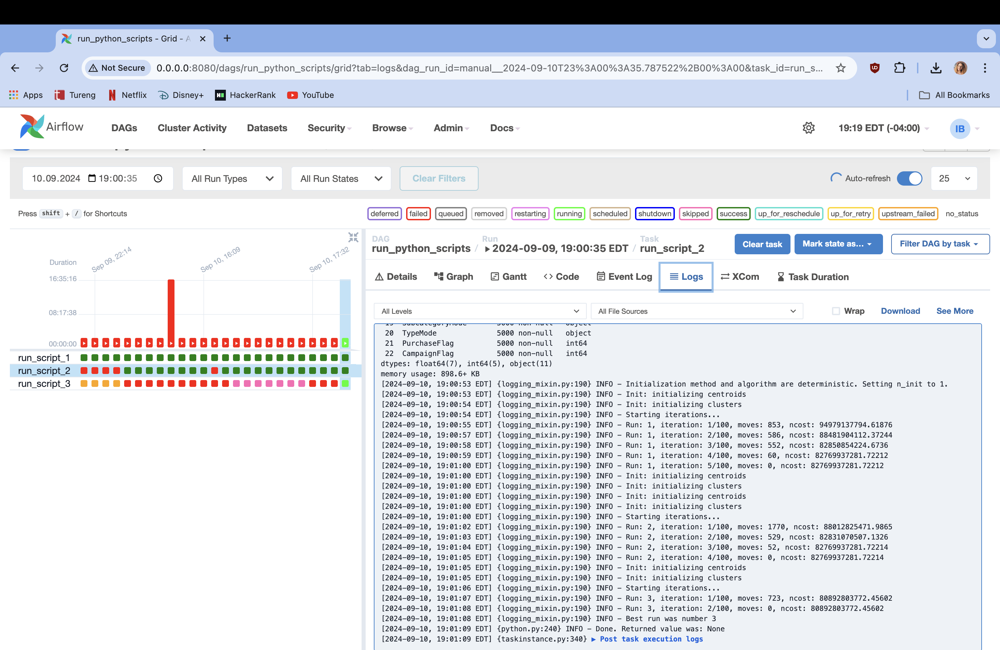

# VB DATA SCIENCE/MACHINE LEARNING/LLM ASSIGNMENT

## Table of Contents

- [Introduction](#introduction)
- [Data Ingestion](#data-ingestion)
- [Data Segmentation](#data-segmentation)
- [Audience Creation](#audience-creation)
- [Campaign Generation](#campaign-generation)
- [Data Pipeline Automation](#data-pipeline-automation)
- [Assumptions and Challenges](#assumptions-and-challenges)

## Introduction

The objective of this project is to develop a comprehensive data pipeline for customer data by analyzing 17 different datasets, cleansing, transformation, segmentation, and campaign generation. The pipeline will utilize machine learning and large language models to segment customers into distinct audiences and generate targeted marketing campaigns. This documentation provides a detailed approach to each phase of the project.

This project consists of five general tasks:

- Developing a data pipeline to efficiently understand, cleanse, and transform customer data from various sources into a suitable format for analysis.
- Apply clustering algorithms to segment customers into distinct groups based on their behaviors and attributes.
- Utilize large language models to analyze the customer segments and create targeted audience profiles.
- Design and generate targeted marketing campaigns that align with the needs of each audience segment.
- Automate the data pipeline workflow, from ingestion to campaign generation.

For this project, Python was the primary programming language, with development and experimentation conducted in Jupyter Notebook. For audience creation, OpenAI’s GPT-4o-mini model was employed to analyze customer segments and generate detailed audience profiles using advanced natural language processing techniques. To automate the data pipeline, Apache Airflow was implemented, ensuring a streamlined and efficient workflow. All code, documentation, and resources will be published on GitHub to maintain transparency.

## Data Ingestion

To begin the data ingestion process, I started with a total of 17 raw datasets. Given the large number of datasets, an organized approach was necessary to manage and understand the data effectively. To facilitate this, a Google Sheets document was created to catalog all datasets along with their column names. This document served as a reference to track the structure and attributes of each dataset. Key identifiers were highlighted using color coding to easily identify critical columns that would be useful in merging datasets later in the process. 

[Google Sheets Link](https://docs.google.com/spreadsheets/d/1bDQS14OqbsS-98H-plKZqIP8G-9TOsTotnURFt6tR3Q/edit?usp=sharing)

**Feature Selection:** As part of the data ingestion process, I evaluated all 17 raw datasets to determine their relevance to the goal of customer segmentation. Some datasets were unrelated to the primary objective and were excluded from the final data merging process. For example, Retailers dataset was not included in the final dataset because the provided attributes, such as retailer name and contact details, were not relevant to the analysis and segmentation of customer data.

**Dataset Management:** To efficiently manage the large volume of datasets, a structured approach was taken. Datasets containing customer and product information were merged into a single dataframe named CustomerBuys. Another dataframe named SellerSells kept retailer and campaign information into another dataset. Then, these two main datasets were merged using key identifiers to create a unified dataset with all relevant information.

**Feature Engineering:** To enhance the dataset for customer segmentation, several feature engineering tasks were handled:

- Campaign Flag: A new feature was created to identify whether a customer's purchase occurred during a campaign period. This feature was derived by comparing the OrderDate of each purchase with the StartDate and EndDate of various campaigns.
- Seasonal Trends: Several date-related features were extracted to analyze seasonal purchasing trends. 'WeekOfMonth' feature determined the week number within the month when a purchase was made. 'Month' feature captured the month of the purchase, while 'Season' feature classified the purchase date into one of the four seasons based on the month. These features provided valuable insights into the temporal patterns of customer behavior.
- Purchase Flag: In CustomerBuys, a new feature was created to indicate whether a customer made a purchase by checking if the CustomerID matched any product information from the products dataset.

**Data Cleaning and Imputation:** After the merging process, unnecessary columns such as key identifiers used for merging were dropped to clean the dataset. Also, some other columns which are redundant to customer segmentation were dropped. Importantly, since non-purchasing customers also provide valuable insights into customer behavior, missing values were handled carefully. Rather than using imputation methods like frequent observation or KNN, missing values were preserved. If the column was categorical, missing data was filled with 'Unknown', and for numerical columns, missing values were replaced with 0. This approach ensured that the data retained meaningful behavioral information while maintaining consistency for analysis.

## Data Segmentation

For the data segmentation task, I used the dataset created in the previous step. Before applying a clustering algorithm, I ensured that the dataset was prepared with exactly 5000 rows, with each row representing one unique customer. I also specified which columns were categorical, providing the clustering algorithm with the necessary index information to treat these columns appropriately.

I selected K-Prototypes clustering method which is particularly well-suited for handling mixed data types to address the mixture of numerical and categorical variables in the dataset. It is an extension of infamous the K-Means algorithm, which is limited to handling only numerical data. The algorithm works by iterating between assigning points to clusters and updating cluster centroids, ensuring that both types of variables are considered when forming clusters.

I used the Elbow Method to determine the optimal number of customer segments. This method helps creating clusters with different values of the number of clusters and plotting the results on a line graph. The point where the cost starts decreasing more slowly, forming an "elbow" shape, indicates the optimal number of clusters. In this case, I generated customer segments with values of k ranging from 1 to 10 and plotted the results. The elbow appeared at k = 3, suggesting that dividing the customers into three distinct segments would provide the best balance between clustering quality and complexity. Finally, I assigned each customer to their respective segment based on the results of the K-Prototypes clustering.

## Audience Creation

Before implementing an LLM to analyze customer segmentations, I needed to reduce the size of the segmented final dataset. Since OpenAI's LLM has token limitations, it restricted the amount of data that could be processed at once. To optimize the data size and fit within the token constraints, I created dictionaries for object-typed (categorical) columns, reducing their string lengths. For example, full state names in the customer demographics were shortened to abbreviations ("California" to "CA") or Gender column, which previously contained "female" and "male" entries, was simplified to "f" and "m".

Despite reducing the string lengths, the dataset was still too large to fit into the LLM at once. As a solution, I split the dataset by customer segments into three separate dataframes. The second segment, which contained the most customers, was further split randomly by 0.5 ratio into two smaller parts to accommodate the model’s input size limits. Then, all dataframes are converted to CSV files to make it manageable for the model since OpenAI's LLM can understand text data.

Once all the datasets were ready, I created specific prompts to guide the GPT-4o-mini model in handling the customer segmentation data and generating audience segments. The prompts included instructions for understanding the segmentation logic and generating insights to create distinct audience groups based on demographic, behavioral, and purchase-based data. These audience segments will serve as the basis for targeted marketing campaigns in the next step.

## Campaigns

- **SEGMENT 1**

    - **High-Value Shoppers**
        - **WHO:** Ages 25-34, male & female, $60K - $70K income, frequent shoppers, engaged with podcasts & influencers
        - **WHAT:** This audience might be interested in luxury product line or exclusive limited edition items
        - **HOW:** Use personalized emails with common product selections based on previous purchases
        - **Campaign Objective:** 
            - Increase customer lifetime value by encouraging repeat high-value purchases
            - Increase brand loyalty with exclusive offers and personalized experiences
            - Drive engagement via channels they already follow (podcasts, influencer content)
        - **Target Messaging:** You deserve the best: exclusive access to limited edition products!
        - **Channel Recommendation:** Influencers, podcasts
        - **Campaign Resonance:** Tailored product recommendations, exclusive offers fostering a sense of prestige and importance

    - **Occasional Shoppers**
        - **WHO:** Ages 35-44, predominantly female, bachelor’s/college dducation, moderate order count
        - **WHAT:** This audience might be interested in bundled offers that include popular products at a discount
        - **HOW:** Engaging and visually appealing content highlighting seasonal offers
        - **Campaign Objective:** 
            - Drive engagement via targeted social media campaigns and personalized email offers
            - Boost sales of seasonal products by creating urgency
        - **Target Messaging:** Refresh your style: exclusive seasonal bundles for you
        - **Channel Recommendation:** Social media, emails
        - **Campaign Resonance:** Offering seasonal discounts aligns with their occasional shopping pattern, limited-time promotions create the feel of urgency and increase the chance of converting this audience into more frequent buyers

    - **Discount Seekers**
        - **WHO:** Ages 18-24, mostly female, high school or some college, driven by sales & discounts
        - **WHAT:** This audience might be interested in flash sales and promotions
        - **HOW:** Create engaging content that highlights the urgency of flash sales and the benefits of referral discounts
        - **Campaign Objective:** 
            - Drive engagement via targeted social media campaigns using flash sales and creating a sense of urgency
            - Increase customer engagement through a referral program
        - **Target Messaging:** Hurry! Flash sale!
        - **Channel Recommendation:** Social media
        - **Campaign Resonance:** Creating a sense of excitement and motivating quick action, leveraging peer influence by referral program, using social media and ensuring the content is in line with their preferred media consumption
        
    - **Elderly Shoppers:**
        - **WHO:** Ages 65+, balanced between male and female, varied education levels, low order count, less engagement with promotions.
        - **WHAT:** Simplified product bundles designed for ease of use
        - **HOW:** Utilize traditional mail or phone calls to deliver special offers, host community events or workshops to engage directly and encourage in-person shopping
        - **Campaign Objective:**
            - Improve engagement by providing a personalized shopping experience and gathering valuable feedback
            - Increase order frequency by simplifying the shopping experience
            - Build a sense of community through events and workshops, encouraging more in-person interaction and loyalty
        - **Target Messaging:** Enjoy a simple shopping experience with offers just for you!
        - **Channel Recommendation:** Traditional mail, accessible website, community events
        - **Campaign Resonance:** Personal touch and simplified shopping for to the preferences of elderly shoppers who may not be as engaged with digital promotions, by focusing on accessibility it fosters a sense of inclusion and makes shopping more comfortable

- **SEGMENT 2**

    - **Young Adolescents**
        - **WHO:** Ages 5-17, primarily female, not employed, below high school diploma, very low order count
        - **WHAT:** Interactive products that appeal to young adolescents, such as branded clothing or gaming-related items
        - **HOW:** Leverage TikTok and Instagram using influencers to create engaging, age-appropriate and interactive content
        - **Campaign Objective:** 
            - Drive initial purchases by creating excitement through interactive content.
            - Increase brand loyalty with exclusive offers and personalized experiences
            - Drive engagement via channels they already follow (podcasts, influencer content)
        - **Target Messaging:** Join the fun: exciting contests!
        - **Channel Recommendation:** TikTok, Instagram, influencer partnerships, interactive online campaigns.
        - **Campaign Resonance:** Engaging young adolescents through popular social media platforms and interactive content, creating fun

    - **Budget-Conscious Families**
        - **WHO:** Mixed gender, varied education, lower to mid-range income, low order frequency, often only for essential items
        - **WHAT:** Promote bulk buying options and subscription services for everyday essentials
        - **HOW:** Use targeted discounts and loyalty programs to encourage repeat purchases
        - **Campaign Objective:** 
            - Increase purchase frequency by offering cost-effective bulk and subscription options
            - Utilize email campaigns to communicate budget-friendly tips and savings.
        - **Target Messaging:** Save more with our bulk deals!
        - **Channel Recommendation:** Email campaigns, targeted online ads, and promotional offers.
        - **Campaign Resonance:** Directly addressing the needs by focusing on savings and value, promoting bulk buying which makes the shopping cost-effective, helping families manage their finances effectively

    - **Middle-Aged Professionals**
        - **WHO:** Ages 35-54, slight male predominance, mostly employed, many with college degrees or higher, mid-range income levels, varied order count, some with multiple orders
        - **WHAT:** Professional development tools, home improvement products, family-oriented items
        - **HOW:** Use email marketing to provide information about the products the audience is interested in, leverage LinkedIn and Facebook to reach this audience through targeted ads
        - **Campaign Objective:** 
            - Enhance customer engagement by offering relevant products that align with their professional and personal lives
            - Increase purchase frequency by emphasizing the quality of items
        - **Target Messaging:** Elevate your professional and personal life with our quality tools!
        - **Channel Recommendation:** Email marketing, LinkedIn, Facebook
        - **Campaign Resonance:** By using professional development tools and home improvement items, the campaign speaks directly to their lifestyle and aspirations. Leveraging LinkedIn and Facebook ensures that the content reaches them in their preferred professional and social spaces, reinforcing the brand's relevance in both areas of their lives.
    

- **SEGMENT 3**

    - **Young Adults**
        - **WHO:** Ages 18-34, predominantly employed, mostly college/associates education, engagement through social media and podcasts, some purchases but many inactive.
        - **WHAT:** Trending products or experiences such as tech gadgets, fashion items, or lifestyle services
        - **HOW:** Run social media campaigns to showcase trending products and special promotions, develop engaging content focused on lifestyle, tech trends, and fashion to align with their interests
        - **Campaign Objective:** 
            - Engage with influencers to promote products through authentic storytelling
            - Create content around lifestyle and interests relevant to this age group
            - Offer promotions on trending products or experiences (e.g., tech gadgets, fashion)
        - **Target Messaging:** Discover the latest trends and exclusive deals on tech and more!
        - **Channel Recommendation:** Instagram, TikTok, influencer collaborations
        - **Campaign Resonance:** The campaign leverages platforms popular with young adults and focuses on trending products and experiences that appeal to their interests. By using influencers for authentic storytelling and creating lifestyle-focused content, the campaign aims to engage this demographic and drive both new and repeat purchases.

    - **Seniors**
        - **WHO:** Age 55 and above, mixed employment status (working or retired), varied education levels with many having higher education, majority female, lower order counts but higher spending when purchasing
        - **WHAT:** Health and wellness products, technology tailored for ease of use, or personalized customer service options
        - **HOW:** Develop content focusing on health, wellness, and user-friendly technology, offer phone support or in-person consultations, design user-friendly online shopping experiences
        - **Campaign Objective:** 
            - Increase engagement and spending by addressing the specific needs of seniors
            - Enhance customer satisfaction with personalized support
            - Reach this demographic through both traditional and digital channels to maximize impact
        - **Target Messaging:** Discover easy solutions for health, wellness, and technology!
        - **Channel Recommendation:** Print media, radio, digital ads, personalized phone support, simplified online shopping experience
        - **Campaign Resonance:** The campaign is designed to cater to seniors by focusing on their specific interests and needs, such as health and wellness and easy-to-use technology. By using a mix of traditional and digital channels and offering personalized support, the campaign aims to connect with seniors in ways that are both familiar and accessible, encouraging them to engage more frequently and comfortably with the brand.

    - **Inactive Customers**
        - **WHO:** Varied age groups, employment statuses, and education levels, with no recorded purchases and potential drop-off in engagement.
        - **WHAT:** Special discounts or educational content on product usage and benefits to encourage re-engagement
        - **HOW:** Use targeted ads across various platforms to remind inactive customers of the brand and its offerings, make surveys to gather insights into why customers have stopped engaging
        - **Campaign Objective:** 
            - Reignite interest and drive re-engagement by offering incentives and understanding customer barriers
            - Gather valuable feedback to improve customer experience and address specific needs
            - Increase brand visibility and encourage inactive customers to return and make a purchase
        - **Target Messaging:** We miss you! Enjoy special discounts with us!
        - **Channel Recommendation:** Email, surveys, remarketing ads.
        - **Campaign Resonance:** The campaign addresses the potential reasons for inactivity by gathering feedback. By utilizing remarketing ads, the campaign aims to re-gain interest and re-engage customers who have not interacted with the brand recently.

## Data Pipeline Automation

Apache Airflow was set up to automate the workflow and I created a configuration file that connects Airflow with the Python scripts of this project. There were minor adjustments to these scripts to ensure they work smoothly within the Airflow environment. The first two tasks, data ingestion and clustering, were successfully implemented and both tasks now run efficiently and quickly in Airflow. 

A key component of this setup involved creating a configuration file named read_scripts.py, which was placed in the dags folder of the Airflow environment. This file creates the connection between Airflow and the project's Python scripts by specifying their paths. The three scripts are in use named DataIngestion.py, Clustering.py, and analyzeaudiencesllm_openai.py. Each of these scripts corresponds to a distinct task in the Airflow DAG. 

 

The tasks mentioned above runs sequentially. The output from the DataIngestion.py task is used as input for the Clustering.py task, and similarly, the analyzeaudiencesllm_openai.py task relies on the output of the Clustering.py task. This setup ensures that the tasks are executed in a specified order, maintaining the integrity of the workflow. Despite the successful implementation of the first two tasks, there was an issue with the third task, which continuously ran without stopping. This problem was potentially linked to the use of an external engine with an API key or issues with integrating the script into Airflow. The third task involves analyzing customer segments using gpt-4o-mini, where each segment sometimes exceeds the engine's token limit due to the large number of customers. I implemented a solution to handle the data and address this issue. The solution involves automating the process of splitting customer segments. Segments with more than 1250 observations are divided into smaller dataframes to fit within the LLM’s maximum token limits. This automation was achieved through loops and conditions that dynamically split the data as needed. Even  with the automated third task, there is still an issue with third script, as it continues to run without stopping. This indicates that further analysis and improvements are necessary to fully resolve the problem for the execution of the task within Airflow.

 

 

For the scheduling of the project, the workflow can be set to run at specified intervals, such as before each campaign period, to create new strategies targeting segment audiences. The scheduling can be divided into two modes: one that includes clustering using the elbow method and one that does not. In the standard run, we can exclude the elbow method, which determines the optimal number of clusters by evaluating between 1 to 10 clusters. This mode is ideal when the existing customer base remains stable, and there is no need to change the clustering. However, if we detect a significant increase in the number of customers, the clustering process using the elbow method can be scheduled to run again. This would help adjusting the number of clusters for the new data.
 
 Airflow is a user-friendly platform, making monitoring the workflow straightforward and simple. We can easily observe task logs, allowing us to detect bugs and their locations within the scripts. The visual representation of the workflow as blocks helps to monitor task execution status in real-time. The color-coding of each status, such as green for success, red for failure, helps tracking progress and quickly identify any issues.

 

 

## Assumptions and Challenges

**Assumptions**
- I didn't use dome datasets initially given to me because they either didn't seem relevant to customer segmentation or had inconsistencies that were difficult to resolve. In a real-world scenario, these decisions should be discussed with stakeholders to ensure that all relevant data is considered and the approach aligns with project goals.

**Challenges**
- During the integration process, some datasets, including the BehavioralData dataset, presented challenges in aligning with other data due to differences in key identifiers (such as CustomerID and ProductID). I created a Google Sheets document to catalog columns in each dataset and highlight key identifiers, which improved understanding and tracking of the datasets. This approach helped in identifying potential ways to better integrate the datasets and explore alternative uses or adjustments if necessary.
- I tried using some LLM engines like Gemini because their APIs were free and I spent some time trying, but they didn’t deliver the results I was hoping for when analyzing the dataset. So, I switched to OpenAI’s GPT-4o-mini model. Even though it came with a cost, it turned out to be way better, giving me accurate insights that really helped with analyzing the data and improving the audience segmentation.
- Dealing with a large datasets and the token limitation was challenging for me. Even after trimming down the length of object-typed values, the dataset was still too big for the LLM to process all at once due to its token limits. To get around this, I split the dataset into smaller groups that could fit within the limit. This made it possible to analyze the data, but took a bit time and effort.

**NOTE:**
To run the project manually, execute the Jupyter Notebook files in the following order:

- DataIngestion.ipynb: This notebook handles the initial data ingestion and preprocessing steps.
- Clustering.ipynb: This notebook performs data segmentation using the K-Prototypes clustering algorithm.
- AnalyzeAudiencesLLM_openai.ipynb: This notebook utilizes the GPT-4o-mini model to analyze the segmented data and create audience segments.

Each notebook contains file paths that reference data locations on the desktop. Ensure that these paths are updated to match the location of your datasets. In the AnalyzeAudiencesLLM_openai.ipynb file, you will need to give your own API key for OpenAI to run the GPT model and get results.
